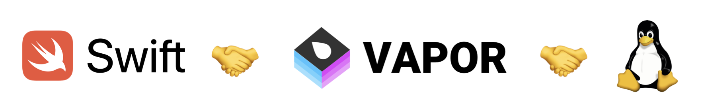

# medo-delirio-api

This is the server counterpart to the [Medo e Delírio iOS/iPadOS/macOS app](https://github.com/rafaelclaycon/MedoDelirioBrasilia).

🌟 Star this repo! ↗️

🐙 [Sponsor me](https://github.com/sponsors/rafaelclaycon) so I can keep making cool stuff!

Prefer to do it in Reais? [Here you go](https://apoia.se/app-medo-delirio-ios).

## Features

1. **Serving New Content:** Seamlessly supports a custom content delivery system built entirely on Apple-native technologies.
2. **Push Notifications:**
- Stores user push notification tokens.
- Sends push notifications to keep users updated.
3. **User Insights (Anonymized)**:
- Collects anonymized device model names and active user data.
- Tracks anonymized content-sharing statistics (opt-out available in the app).
- Stores anonymized usage metrics.
4. **Content Sharing Rankings**:
Delivers Top 10 Most Shared Content rankings to the app (all-time and date-specific).
5. **Developer Metrics**: Provides total user base counts for the curious developer.
6. **Feature Flags**: Offers on/off switches for controlling app-side content.

## How to run this project

To build and run this project, you'll need:

- A Mac running macOS 13.5 Ventura or later;
- Xcode 15.2 or later;
- admin privileges on the Mac's user account to run and bind the server to the 8080 port.

That's it.

## Curious about how this runs?

This is an API built for the [Medo e Delírio iOS app](https://github.com/rafaelclaycon/MedoDelirioBrasilia) written in 100% Swift that relies on the [Vapor framework](https://vapor.codes) to work. It runs on a Linux VM (Ubuntu to be specific) that costs me just 5 Dollars a month and serves an average of 5,000 unique monthly users, sync system and all. I think that's pretty neat.

## 🚧 Work in Progress 🚧

This project does not use random access tokens or any other client-server communication security measure. This is a small project coded by just me (a mostly front-end person) and no personal life-threatening information is sent back and forth. I do plan on adding HTTPS support in the near future.

That said, if you want to help make this better, you're more than welcome to do so by opening a pull request (let's see some code!).

## About this repo

Rafael C. Schmitt – [@mitt_rafael@toot.wales](https://toot.wales/@mitt_rafael)

Distributed under the MIT license. See ``LICENSE`` for more information.
